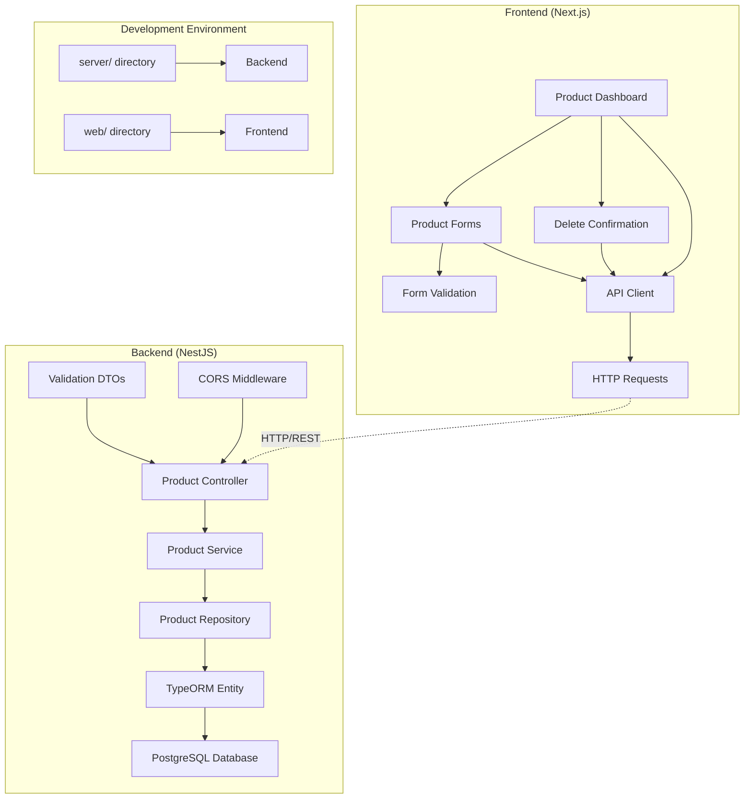

# Design Document: Product Management Application

## Overview

The Product Management Application is a fullstack system consisting of two independent applications: a NestJS backend server with Fastify adapter and a Next.js frontend with App Router. The system provides complete CRUD operations for product management through a professional web interface, designed to showcase fullstack development fundamentals.

The architecture emphasizes separation of concerns, with the backend serving as a pure API layer and the frontend handling all user interface logic. Communication occurs exclusively through HTTP REST API calls, ensuring loose coupling and independent deployability.

## Architecture

### System Architecture



### Technology Stack

**Backend (server/)**:
- NestJS framework with Fastify adapter for high performance
- TypeORM for database operations with PostgreSQL
- Class-validator and class-transformer for data validation and transformation
- Environment configuration with dotenv
- CORS configuration for cross-origin requests

**Frontend (web/)**:
- Next.js 14+ with App Router for modern React patterns
- Axios for HTTP client with interceptors for error handling
- React hooks (useState, useEffect, useCallback) for state management
- TypeScript for type safety throughout
- shadcn/ui component library for professional UI components
- Global CSS with CSS custom properties for theming and responsive design
- Tailwind CSS for utility-first styling (integrated with shadcn/ui)
- Utilizing the power of shadcn in creating forms and dashboard
- Utilizing the template theme that i have in the global.css and you can extend it depending on what you want to do

### Directory Structure

```
product-management-app/
├── server/
│   ├── src/
│   │   ├── products/
│   │   │   ├── dto/
│   │   │   ├── entities/
│   │   │   ├── products.controller.ts
│   │   │   ├── products.service.ts
│   │   │   └── products.module.ts
│   │   ├── database/
│   │   ├── app.module.ts
│   │   └── main.ts
│   ├── package.json
│   ├── tsconfig.json
│   └── .env
└── web/
    ├── src/
    │   ├── app/
    │   │   ├── components/
    │   │   ├── lib/
    │   │   ├── types/
    │   │   ├── layout.tsx
    │   │   └── page.tsx
    │   └── styles/
    │       └── globals.css
    ├── package.json
    ├── tsconfig.json
    └── next.config.js
```

## Components and Interfaces

### Backend Components

#### Enhanced Product Entity with Advanced Features
```typescript
@Entity('products')
export class Product {
  @PrimaryGeneratedColumn('uuid')
  id: string;

  @Column({ length: 255 })
  @Index()
  name: string;

  @Column('text')
  description: string;

  @Column('decimal', { precision: 10, scale: 2 })
  price: number;

  @Column('int')
  quantity: number;

  @Column({ length: 100 })
  @Index()
  category: string;

  @Column({ length: 500, nullable: true })
  imageUrl?: string;

  @Column({ length: 50, nullable: true })
  sku?: string;

  @Column('decimal', { precision: 5, scale: 2, nullable: true })
  weight?: number;

  @Column('json', { nullable: true })
  dimensions?: {
    length: number;
    width: number;
    height: number;
    unit: 'cm' | 'in';
  };

  @Column('simple-array', { nullable: true })
  tags?: string[];

  @Column({ default: true })
  isActive: boolean;

  @Column('int', { default: 0 })
  minStockLevel: number;

  @Column('decimal', { precision: 10, scale: 2, nullable: true })
  costPrice?: number;

  @Column('text', { nullable: true })
  notes?: string;

  @CreateDateColumn()
  createdAt: Date;

  @UpdateDateColumn()
  updatedAt: Date;
}
```

#### Comprehensive Data Transfer Objects
```typescript
export class CreateProductDto {
  @IsString()
  @IsNotEmpty()
  @MaxLength(255)
  name: string;

  @IsString()
  @IsNotEmpty()
  description: string;

  @IsNumber()
  @IsPositive()
  @Transform(({ value }) => parseFloat(value))
  price: number;

  @IsInt()
  @IsPositive()
  @Transform(({ value }) => parseInt(value))
  quantity: number;

  @IsString()
  @IsNotEmpty()
  @MaxLength(100)
  category: string;

  @IsOptional()
  @IsUrl()
  @MaxLength(500)
  imageUrl?: string;

  @IsOptional()
  @IsString()
  @MaxLength(50)
  sku?: string;

  @IsOptional()
  @IsNumber()
  @IsPositive()
  @Transform(({ value }) => parseFloat(value))
  weight?: number;

  @IsOptional()
  @ValidateNested()
  @Type(() => DimensionsDto)
  dimensions?: DimensionsDto;

  @IsOptional()
  @IsArray()
  @IsString({ each: true })
  tags?: string[];

  @IsOptional()
  @IsBoolean()
  isActive?: boolean;

  @IsOptional()
  @IsInt()
  @Min(0)
  minStockLevel?: number;

  @IsOptional()
  @IsNumber()
  @IsPositive()
  @Transform(({ value }) => parseFloat(value))
  costPrice?: number;

  @IsOptional()
  @IsString()
  notes?: string;
}

export class DimensionsDto {
  @IsNumber()
  @IsPositive()
  length: number;

  @IsNumber()
  @IsPositive()
  width: number;

  @IsNumber()
  @IsPositive()
  height: number;

  @IsEnum(['cm', 'in'])
  unit: 'cm' | 'in';
}

export class UpdateProductDto extends PartialType(CreateProductDto) {}

export class ProductQueryDto {
  @IsOptional()
  @IsString()
  search?: string;

  @IsOptional()
  @IsString()
  category?: string;

  @IsOptional()
  @IsNumber()
  @Min(0)
  @Transform(({ value }) => parseFloat(value))
  minPrice?: number;

  @IsOptional()
  @IsNumber()
  @Min(0)
  @Transform(({ value }) => parseFloat(value))
  maxPrice?: number;

  @IsOptional()
  @IsBoolean()
  @Transform(({ value }) => value === 'true')
  isActive?: boolean;

  @IsOptional()
  @IsInt()
  @Min(1)
  @Transform(({ value }) => parseInt(value))
  page?: number = 1;

  @IsOptional()
  @IsInt()
  @Min(1)
  @Max(100)
  @Transform(({ value }) => parseInt(value))
  limit?: number = 20;

  @IsOptional()
  @IsEnum(['name', 'price', 'quantity', 'createdAt', 'updatedAt'])
  sortBy?: string = 'createdAt';

  @IsOptional()
  @IsEnum(['ASC', 'DESC'])
  sortOrder?: 'ASC' | 'DESC' = 'DESC';
}
```

#### Enhanced Product Controller with Advanced Features
```typescript
@Controller('products')
export class ProductsController {
  constructor(private readonly productsService: ProductsService) {}

  @Get()
  async findAll(@Query() query: ProductQueryDto): Promise<ApiResponse<PaginatedResponse<Product>>> {
    const result = await this.productsService.findAll(query);
    return { success: true, data: result };
  }

  @Get('categories')
  async getCategories(): Promise<ApiResponse<string[]>> {
    const categories = await this.productsService.getCategories();
    return { success: true, data: categories };
  }

  @Get('search')
  async search(@Query('q') query: string): Promise<ApiResponse<Product[]>> {
    const products = await this.productsService.search(query);
    return { success: true, data: products };
  }

  @Get('low-stock')
  async getLowStockProducts(): Promise<ApiResponse<Product[]>> {
    const products = await this.productsService.getLowStockProducts();
    return { success: true, data: products };
  }

  @Get(':id')
  async findOne(@Param('id', ParseUUIDPipe) id: string): Promise<ApiResponse<Product>> {
    const product = await this.productsService.findOne(id);
    return { success: true, data: product };
  }

  @Post()
  async create(@Body() createProductDto: CreateProductDto): Promise<ApiResponse<Product>> {
    const product = await this.productsService.create(createProductDto);
    return { success: true, data: product, message: 'Product created successfully' };
  }

  @Post('bulk')
  async createBulk(@Body() createProductsDto: CreateProductDto[]): Promise<ApiResponse<Product[]>> {
    const products = await this.productsService.createBulk(createProductsDto);
    return { success: true, data: products, message: `${products.length} products created successfully` };
  }

  @Put(':id')
  async update(
    @Param('id', ParseUUIDPipe) id: string,
    @Body() updateProductDto: UpdateProductDto
  ): Promise<ApiResponse<Product>> {
    const product = await this.productsService.update(id, updateProductDto);
    return { success: true, data: product, message: 'Product updated successfully' };
  }

  @Patch(':id/stock')
  async updateStock(
    @Param('id', ParseUUIDPipe) id: string,
    @Body() stockUpdate: { quantity: number; operation: 'set' | 'add' | 'subtract' }
  ): Promise<ApiResponse<Product>> {
    const product = await this.productsService.updateStock(id, stockUpdate.quantity, stockUpdate.operation);
    return { success: true, data: product, message: 'Stock updated successfully' };
  }

  @Patch(':id/toggle-active')
  async toggleActive(@Param('id', ParseUUIDPipe) id: string): Promise<ApiResponse<Product>> {
    const product = await this.productsService.toggleActive(id);
    return { success: true, data: product, message: 'Product status updated successfully' };
  }

  @Delete(':id')
  async remove(@Param('id', ParseUUIDPipe) id: string): Promise<ApiResponse<null>> {
    await this.productsService.remove(id);
    return { success: true, data: null, message: 'Product deleted successfully' };
  }

  @Delete('bulk')
  async removeBulk(@Body() ids: string[]): Promise<ApiResponse<null>> {
    await this.productsService.removeBulk(ids);
    return { success: true, data: null, message: `${ids.length} products deleted successfully` };
  }
}
```

### Frontend Components

#### Type Definitions
```typescript
export interface Product {
  id: string;
  name: string;
  description: string;
  price: number;
  quantity: number;
  category: string;
  imageUrl?: string;
  createdAt: string;
  updatedAt: string;
}

export interface CreateProductRequest {
  name: string;
  description: string;
  price: number;
  quantity: number;
  category: string;
  imageUrl?: string;
}

export interface ApiResponse<T> {
  success: boolean;
  data: T;
  message?: string;
  errors?: string[];
}
```

#### API Client Service
```typescript
class ApiClient {
  private client: AxiosInstance;

  constructor() {
    this.client = axios.create({
      baseURL: process.env.NEXT_PUBLIC_API_URL || 'http://localhost:3001',
      timeout: 10000,
    });

    this.setupInterceptors();
  }

  private setupInterceptors() {
    this.client.interceptors.response.use(
      (response) => response,
      (error) => {
        if (error.response?.status === 404) {
          throw new Error('Resource not found');
        }
        if (error.response?.status >= 500) {
          throw new Error('Server error occurred');
        }
        throw error;
      }
    );
  }

  async getProducts(): Promise<Product[]> {
    const response = await this.client.get<ApiResponse<Product[]>>('/products');
    return response.data.data;
  }

  async getProduct(id: string): Promise<Product> {
    const response = await this.client.get<ApiResponse<Product>>(`/products/${id}`);
    return response.data.data;
  }

  async createProduct(product: CreateProductRequest): Promise<Product> {
    const response = await this.client.post<ApiResponse<Product>>('/products', product);
    return response.data.data;
  }

  async updateProduct(id: string, product: Partial<CreateProductRequest>): Promise<Product> {
    const response = await this.client.put<ApiResponse<Product>>(`/products/${id}`, product);
    return response.data.data;
  }

  async deleteProduct(id: string): Promise<void> {
    await this.client.delete(`/products/${id}`);
  }
}
```

#### Product Dashboard Component
```typescript
export default function ProductDashboard() {
  const [products, setProducts] = useState<Product[]>([]);
  const [loading, setLoading] = useState(true);
  const [error, setError] = useState<string | null>(null);

  const loadProducts = useCallback(async () => {
    try {
      setLoading(true);
      const data = await apiClient.getProducts();
      setProducts(data);
    } catch (err) {
      setError('Failed to load products');
    } finally {
      setLoading(false);
    }
  }, []);

  const handleDelete = async (id: string) => {
    // Optimistic update
    const originalProducts = products;
    setProducts(prev => prev.filter(p => p.id !== id));

    try {
      await apiClient.deleteProduct(id);
    } catch (err) {
      // Revert on error
      setProducts(originalProducts);
      setError('Failed to delete product');
    }
  };

  useEffect(() => {
    loadProducts();
  }, [loadProducts]);

  if (loading) return <LoadingSpinner />;
  if (error) return <ErrorMessage message={error} />;

  return (
    <div className="product-dashboard">
      <div className="dashboard-header">
        <h1>Product Management</h1>
        <Link href="/products/new" className="btn-primary">
          Add Product
        </Link>
      </div>
      <div className="product-grid">
        {products.map(product => (
          <ProductCard
            key={product.id}
            product={product}
            onDelete={handleDelete}
          />
        ))}
      </div>
    </div>
  );
}
```

## Data Models

### Database Schema

The PostgreSQL database will contain a single `products` table with the following structure:

```sql
CREATE TABLE products (
  id UUID PRIMARY KEY DEFAULT gen_random_uuid(),
  name VARCHAR(255) NOT NULL,
  description TEXT NOT NULL,
  price DECIMAL(10,2) NOT NULL CHECK (price > 0),
  quantity INTEGER NOT NULL CHECK (quantity >= 0),
  category VARCHAR(100) NOT NULL,
  image_url VARCHAR(500),
  created_at TIMESTAMP WITH TIME ZONE DEFAULT NOW(),
  updated_at TIMESTAMP WITH TIME ZONE DEFAULT NOW()
);

CREATE INDEX idx_products_category ON products(category);
CREATE INDEX idx_products_created_at ON products(created_at);
```

### Data Validation Rules

**Server-side validation (class-validator)**:
- `name`: Required, string, max 255 characters
- `description`: Required, string, no length limit
- `price`: Required, positive decimal number with 2 decimal places
- `quantity`: Required, non-negative integer
- `category`: Required, string, max 100 characters
- `imageUrl`: Optional, valid URL format, max 500 characters

**Client-side validation**:
- Form validation occurs before submission
- Real-time validation feedback for user experience
- Matches server-side validation rules
- Additional UX validations (e.g., price formatting)

### API Response Format

All API responses follow a consistent format:

```typescript
interface ApiResponse<T> {
  success: boolean;
  data: T;
  message?: string;
  errors?: string[];
}
```

**Success Response Example**:
```json
{
  "success": true,
  "data": {
    "id": "123e4567-e89b-12d3-a456-426614174000",
    "name": "Laptop",
    "description": "High-performance laptop",
    "price": 999.99,
    "quantity": 10,
    "category": "Electronics",
    "imageUrl": "https://example.com/laptop.jpg",
    "createdAt": "2024-01-01T00:00:00Z",
    "updatedAt": "2024-01-01T00:00:00Z"
  },
  "message": "Product created successfully"
}
```

**Error Response Example**:
```json
{
  "success": false,
  "data": null,
  "errors": [
    "name must be a string",
    "price must be a positive number"
  ]
}
```

## Correctness Properties

*A property is a characteristic or behavior that should hold true across all valid executions of a system-essentially, a formal statement about what the system should do. Properties serve as the bridge between human-readable specifications and machine-verifiable correctness guarantees.*

Based on the prework analysis, the following properties have been identified from the testable acceptance criteria:

### Property 1: Product Data Structure Completeness
*For any* product created or retrieved from the system, it should contain all required fields: id, name, description, price, quantity, category, imageUrl (optional), and timestamp fields (createdAt, updatedAt)
**Validates: Requirements 3.1, 3.2, 3.3, 3.4, 3.5, 3.6, 3.7, 3.8**

### Property 2: API Response Format Consistency
*For any* API endpoint response, the response should follow the consistent JSON format with success, data, and optional message/errors fields
**Validates: Requirements 4.7**

### Property 3: Input Validation Error Handling
*For any* invalid data submitted to the backend, the server should return appropriate error responses with descriptive messages and correct HTTP status codes
**Validates: Requirements 4.6, 8.5, 8.6, 10.4**

### Property 4: Product Dashboard Data Display
*For any* product displayed on the dashboard, the rendered content should contain all required product information (name, description, price, quantity, category) and display images when available
**Validates: Requirements 5.2, 5.3**

### Property 5: Dashboard Action Availability
*For any* product displayed on the dashboard, edit and delete actions should be available and accessible
**Validates: Requirements 5.5**

### Property 6: Loading State Management
*For any* asynchronous operation in the frontend, loading states should be displayed during the operation and cleared when complete
**Validates: Requirements 5.7, 8.4**

### Property 7: Form Field Completeness
*For any* product form (create or edit mode), input fields should be provided for all required product properties
**Validates: Requirements 6.1**

### Property 8: Form Validation Behavior
*For any* form submission with invalid data, the form should validate required fields and data types, preventing submission and displaying clear error messages
**Validates: Requirements 6.2, 6.3, 6.4, 8.2, 10.3**

### Property 9: Form Mode Behavior
*For any* product form in edit mode, the form should pre-populate fields with existing product data and support both create and edit operations
**Validates: Requirements 6.5, 6.6**

### Property 10: Delete Confirmation Flow
*For any* product deletion attempt, a confirmation dialog should appear identifying the product, and deletion should only proceed when confirmed or be aborted when cancelled
**Validates: Requirements 7.1, 7.2, 7.4, 7.5**

### Property 11: Optimistic UI Updates
*For any* product operation (create, update, delete), the frontend should immediately reflect changes in the UI and revert changes if the server operation fails
**Validates: Requirements 9.1, 9.2, 9.3, 9.4, 9.5**

### Property 12: Error Handling and User Feedback
*For any* operation (success or failure), the frontend should provide appropriate user feedback through error messages for failures and positive feedback for successes
**Validates: Requirements 8.1, 8.3, 10.5**

### Property 13: Network Error Resilience
*For any* network connectivity issue or server unavailability, the frontend should handle the situation gracefully and display appropriate error messages
**Validates: Requirements 11.5, 11.6**

### Property 14: Data Consistency
*For any* product data, the information should remain consistent between frontend display and backend storage throughout all operations
**Validates: Requirements 10.6**

## Error Handling

### Backend Error Handling

**Validation Errors**:
- Use class-validator decorators for automatic DTO validation
- Return 400 Bad Request with detailed field-level error messages
- Transform validation errors into user-friendly messages

**Not Found Errors**:
- Return 404 Not Found for non-existent product IDs
- Include descriptive error messages identifying the missing resource

**Server Errors**:
- Return 500 Internal Server Error for unexpected failures
- Log detailed error information for debugging
- Return generic error messages to clients for security

**Database Errors**:
- Handle connection failures gracefully
- Implement retry logic for transient failures
- Return appropriate HTTP status codes based on error type

### Frontend Error Handling

**API Communication Errors**:
- Implement Axios interceptors for centralized error handling
- Display user-friendly error messages for different error types
- Provide retry mechanisms for transient failures

**Form Validation Errors**:
- Implement real-time validation feedback
- Highlight invalid fields with clear error messages
- Prevent form submission until all validation passes

**Network Connectivity**:
- Detect network failures and display appropriate messages
- Implement offline state detection and user notification
- Provide manual retry options for failed operations

**Optimistic Update Failures**:
- Revert UI changes when server operations fail
- Display error messages explaining the failure
- Allow users to retry failed operations

## Testing Strategy

### Dual Testing Approach

The application will implement both unit testing and property-based testing to ensure comprehensive coverage:

**Unit Tests**:
- Test specific examples and edge cases
- Verify integration points between components
- Test error conditions and boundary cases
- Focus on concrete scenarios and known inputs

**Property-Based Tests**:
- Verify universal properties across all inputs
- Use randomized input generation for comprehensive coverage
- Test invariants and behavioral contracts
- Ensure correctness across the entire input space

### Backend Testing

**Unit Testing with Jest**:
- Test individual service methods with specific inputs
- Test controller endpoints with known request/response pairs
- Test error handling with specific error scenarios
- Test database operations with mock data

**Property-Based Testing with fast-check**:
- Generate random product data to test validation rules
- Test API response format consistency across all endpoints
- Verify error handling behavior with various invalid inputs
- Test data transformation and serialization properties

**Configuration**:
- Minimum 100 iterations per property test
- Each property test tagged with: **Feature: product-management-app, Property {number}: {property_text}**
- Integration with Jest test runner
- Automated test execution in CI/CD pipeline

### Frontend Testing

**Unit Testing with Jest and React Testing Library**:
- Test component rendering with specific props
- Test user interactions with known scenarios
- Test form validation with specific invalid inputs
- Test error handling with mock API failures

**Property-Based Testing with fast-check**:
- Generate random product data to test component rendering
- Test form validation with various invalid input combinations
- Verify optimistic update behavior with random operations
- Test error handling with various failure scenarios

**Configuration**:
- Minimum 100 iterations per property test
- Each property test tagged with: **Feature: product-management-app, Property {number}: {property_text}**
- Mock API calls for isolated frontend testing
- Test both success and failure scenarios

### Integration Testing

**API Integration Tests**:
- Test complete request/response cycles
- Verify database persistence and retrieval
- Test CORS configuration with cross-origin requests
- Test error propagation from backend to frontend

**End-to-End Testing Considerations**:
- While not part of the core implementation, E2E tests could verify complete user workflows
- Test the interaction between independent frontend and backend applications
- Verify proper error handling across the application boundary

### Test Organization

**Backend Test Structure**:
```
server/src/
├── products/
│   ├── __tests__/
│   │   ├── products.controller.spec.ts
│   │   ├── products.service.spec.ts
│   │   └── products.properties.spec.ts
│   └── ...
```

**Frontend Test Structure**:
```
web/src/
├── app/
│   ├── components/
│   │   ├── __tests__/
│   │   │   ├── ProductDashboard.test.tsx
│   │   │   ├── ProductForm.test.tsx
│   │   │   └── components.properties.test.tsx
│   └── ...
```

**Property Test Examples**:

Backend property test:
```typescript
// Feature: product-management-app, Property 1: Product Data Structure Completeness
describe('Product creation properties', () => {
  it('should create products with all required fields', () => {
    fc.assert(fc.property(
      fc.record({
        name: fc.string({ minLength: 1, maxLength: 255 }),
        description: fc.string({ minLength: 1 }),
        price: fc.float({ min: 0.01, max: 999999.99 }),
        quantity: fc.integer({ min: 0, max: 999999 }),
        category: fc.string({ minLength: 1, maxLength: 100 }),
        imageUrl: fc.option(fc.webUrl())
      }),
      async (productData) => {
        const product = await productsService.create(productData);
        expect(product).toHaveProperty('id');
        expect(product).toHaveProperty('createdAt');
        expect(product).toHaveProperty('updatedAt');
        expect(product.name).toBe(productData.name);
        expect(product.description).toBe(productData.description);
        expect(product.price).toBe(productData.price);
        expect(product.quantity).toBe(productData.quantity);
        expect(product.category).toBe(productData.category);
      }
    ));
  });
});
```

Frontend property test:
```typescript
// Feature: product-management-app, Property 11: Optimistic UI Updates
describe('Optimistic UI update properties', () => {
  it('should immediately reflect product creation in UI', () => {
    fc.assert(fc.property(
      fc.record({
        name: fc.string({ minLength: 1, maxLength: 255 }),
        description: fc.string({ minLength: 1 }),
        price: fc.float({ min: 0.01, max: 999999.99 }),
        quantity: fc.integer({ min: 0, max: 999999 }),
        category: fc.string({ minLength: 1, maxLength: 100 })
      }),
      async (productData) => {
        const { getByText, queryByText } = render(<ProductDashboard />);
        
        // Initially product should not exist
        expect(queryByText(productData.name)).toBeNull();
        
        // Trigger optimistic creation
        await userEvent.click(getByText('Add Product'));
        await userEvent.type(getByLabelText('Name'), productData.name);
        // ... fill other fields
        await userEvent.click(getByText('Save'));
        
        // Product should immediately appear (optimistic update)
        expect(getByText(productData.name)).toBeInTheDocument();
      }
    ));
  });
});
```

This comprehensive testing strategy ensures both specific scenario coverage through unit tests and universal correctness verification through property-based tests, providing confidence in the application's reliability and correctness.